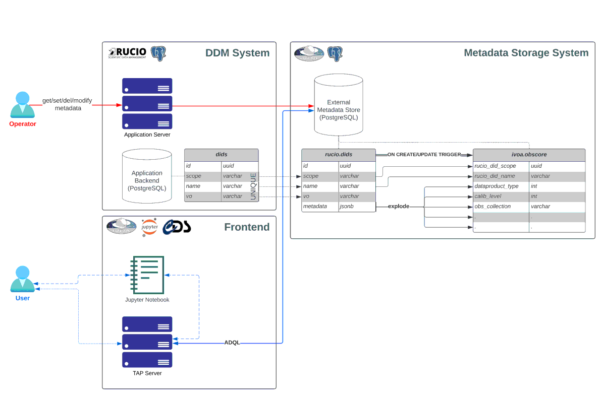
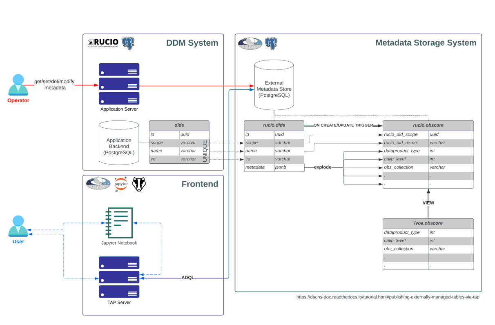

Data access demonstration: [](https://binderhub.srcdev.skao.int/v2/gl/ska-telescope%2Fsrc%2Fska-rucio-ivoa-integration/main?labpath=binder%2Ftest_data_discovery_access_dachs_datalink.ipynb)

SODA cutout demonstration: [](https://binderhub.srcdev.skao.int/v2/gl/ska-telescope%2Fsrc%2Fska-rucio-ivoa-integration/main?labpath=binder%2Ftest_data_discovery_access_dachs_datalink_cutout.ipynb)

# SKA Rucio IVOA Integration

[[_TOC_]]

## Repository architecture

This repository demonstrates how common IVOA services for data discovery and access may be integrated with [Rucio](https://github.com/rucio/rucio).

Two IVOA implementations are currently supported, but with varying degrees of functionality:

- the [TAP library from CDS]((http://cdsportal.u-strasbg.fr/taptuto/index.html)), and
- [DaCHS](https://docs.g-vo.org/DaCHS/)

The full stack comprises five microservices, a combination of which need to be run for each stack. That is to say, **one** IVOA service provider, which is either

- an instance of Apache Tomcat running the CDS Tap library servlet (`tomcat-tap`), **or**
- an instance of DaCHS (`dachs`)

and a set of common services, most of which are optional and depend on what functionality needs to be demonstrated: 

1. an instance of postgres with the [pgSphere](https://pgsphere.github.io/) extension enabled and necessary schema (`postgres-metadata`), 
2. (optional) an instance of jupyterlab with notebooks demonstrating how to interact with these IVOA services using [pyvo](https://pypi.org/project/pyvo/) (`jupyter`),
3. (optional, DaCHS only) a [Datalink](https://www.ivoa.net/documents/DataLink/) service that can be used to return an IVOA compliant `VOTable` describing the location of the nearest Rucio replica for a given DID. Note that the datalink service has only been tested with the DaCHS implementation.

The postgres schema is dependent on which IVOA service provider is selected. As such, when building the `postgres-metadata` service it is necessary to provide the build argument `POSTGRES_INIT_DIR` which specifies the directory containing the database initialisation scripts (relative to `etc/init`).

Docker compose files are available for local development. Some Helm files are provided for deployment on kubernetes clusters.

## Running a TAP service

### Using the CDS Tap Library

The backend database for the CDS Tap library is initialised with the following constructions:

- A schema, `TAP_SCHEMA`, that contains the necessary tables to expose a TAP service (essentially a record of what tables/columns/keys the IVOA service uses),
- A table, `dids`, under schema `rucio`, that "mocks" the table that the external postgres Rucio metadata interface interacts with. This table has nothing to do with IVOA, and is used to hold arbitrary Rucio metadata,
- A table, `obscore`, under schema `ivoa`, that contains the necessary columns for a TAP service to interact with according to the [ObsCore 1.1 DM](https://www.ivoa.net/documents/ObsCore/), and
- A function and trigger that updates the `ivoa.obscore` table from `rucio.dids` everytime there is an `INSERT` or `UPDATE` statement

The function to insert/update records in the `ivoa.obscore` table is set up in such a way that updates to the `rucio.dids.data` column will first delete any row where both `rucio.dids.scope` = `ivoa.obscore.rucio_did_scope` and `rucio.dids.name` = `ivoa.obscore.rucio_did_name` before inserting, i.e. the function is essentially an upsert, keeping data in sync between the two tables.



#### Available endpoints

##### Local

| Service | Port | Landing page | Default user | Default password | Other credentials |
|---------|------|--------------|--------------|------------------|-------------------|
| tomcat-tap | 8080 | http://localhost:8080/tapserver/tap | | | |
| jupyter-vo | 8888 | http://localhost:8888/jupyter/lab| | secret |  |
| postgres-metadata | 5432 | | postgres | secret | database=metadata |

#### Deployment

##### Local

These services can be built and brought up locally using `docker-compose`, specifying the build argument `POSTGRES_INIT_DIR=cds`:

```bash
$ docker-compose build --build-arg POSTGRES_INIT_DIR=cds postgres tomcat jupyter
$ docker-compose up tomcat jupyter postgres
```

### Using the DaCHS library

The backend database for DaCHS is initialised with the following constructions:

- A table, `dids`, under schema `rucio`, that "mocks" the table that the external postgres Rucio metadata interface interacts with. This table has nothing to do with IVOA, and is used to hold arbitrary Rucio metadata,
- A table, `obscore`, under schema `rucio`, that contains the necessary columns for a TAP service to interact with according to the [ObsCore 1.1 DM](https://www.ivoa.net/documents/ObsCore/), and
- A function and trigger that updates the `rucio.obscore` table from `rucio.dids` everytime there is an `INSERT` or `UPDATE` statement

The function to insert/update records in the `rucio.obscore` table is set up in such a way that updates to the `rucio.dids.data` column will first delete any row where both `rucio.dids.scope` = `rucio.obscore.rucio_did_scope` and `rucio.dids.name` = `ivoa.obscore.rucio_did_name` before inserting, i.e. the function is essentially an upsert, keeping data in sync between the two tables.

Note that, unlike with the CDS deployment, both `dids` and `obscore` tables are kept under the `rucio` schema; DaCHS must be left to manage the `ivoa` schema.



#### Available endpoints

##### Local

| Service            | Port  | Landing page | Default user | Default password | Other credentials |
|--------------------|-------|--------------|--------------|-----------------|-------------------|
| dachs web frontend | 8080  | http://localhost:8080/ | | | |
| dachs tap server   | 8080  | http://localhost:8080/__system__/tap/ | | | |
| jupyter-vo         | 8888  | http://localhost:8888/lab | secret | |
| postgres-metadata  | 5432  | | postgres | secret | database=metadata |

#### Deployment

Before deployment, one must decide how the existing `rucio.obscore` data is to be managed by DaCHS. There are two ways of doing this:

- using an external database connection ([odbcGrammar](https://docs.g-vo.org/DaCHS/ref.html#element-odbcgrammar)) to connect and import the data, or
- telling DaCHS that this is [an externally managed table](https://dachs-doc.readthedocs.io/tutorial.html#publishing-externally-managed-tables-via-tap)

Both of these methods are implemented as DaCHS "resource descriptors" (RDs), but both RDs cannot coexist. As such, you must first uncomment/comment the relevant lines in `etc/docker/init.sh` under "importing RDs". By default, it is set to use an externally managed table. When using an external database connection, one must reimport data when the base `rucio.obscore` table changes. This is not true with externally managed tables.

##### Locally

These services can be built and brought up locally using `docker-compose`, specifying the build argument `POSTGRES_INIT_DIR=dachs`:

```bash
$ docker-compose build --build-arg POSTGRES_INIT_DIR=dachs postgres dachs jupyter 
$ docker-compose up dachs jupyter postgres
```

##### To Kubernetes

The postgres metadata database and DaCHS can both be deployed to kubernetes using Helm. The postgres deployment is based off the bitnami/postgres image and uses the Bitnami chart for more easily setting up persistence etc. Note that the `pg_hba.conf` and `postgresql.conf` files in `postgres-metadata/etc/postgres` are ignored when the building the image as they get overwritten when requesting persistence; they instead must be specified in the Helm chart values as per the Bitnami modus operandi.

```bash
$ helm upgrade --install -n rucio-ivoa-integration dachs /path/to/dachs/helm/chart --values dachs-values.yaml
$ helm upgrade --install postgres-metadata --namespace rucio bitnami/postgresql --values postgres-metadata-values.yaml
```

#### Development hints

##### Modifying RDs

If modifying an RD, one must republish the RD, e.g. for the rucio RD:

```bash
$ gavo pub <path/to/file> && gavo serve reload
$ gavo serve reload
````

Note that just using the reference e.g. rucio/rucio will only republish the cached RD!

You may need to run `gavo imp` on the RD for it to make the table & show in the `tap_schema` tables.

##### Logs

Logfiles for DaCHS can be found at `/var/gavo/logs/dc*`.

## Running an SCS service and enabling data access (DaCHS only)

The following has only been considered for the DaCHS implementation and builds upon the TAP service implementation. See `Running a TAP service -> Using the DaCHS library` for more information. It requires access to the SRCNet Data Management and Site Capabilities APIs.

#### Additional available endpoints

These endpoints are additional to the ones described in `Running a TAP service -> Using the DaCHS library`.

##### Local

| Service            | Port  | Landing page                                   | Default user                                 | Default password | Other credentials |
|--------------------|-------|------------------------------------------------|----------------------------------------------|-----------------|-------------------|
| DaCHS SCS endpoint | 8080  | http://localhost:8080/rucio/rucio/cone/scs.xml | | | |
| rucio-datalink     | 10000 | http://localhost:10000/links                   | | | |

#### Deployment

The `rucio-datalink` service requires the following additional environment variables to be set in the container, e.g. by using a `.env` file:

- `DATA_MANAGEMENT_CLIENT_SECRET` is the data-management API (service) client secret,

##### Locally

These services can be built and brought up using `docker-compose`, specifying the build argument `POSTGRES_INIT_DIR=dachs`:

```bash
$ docker-compose build --build-arg POSTGRES_INIT_DIR=dachs postgres dachs jupyter datalink
$ docker-compose up dachs jupyter postgres datalink
```

##### To Kubernetes

## Database considerations

Three methods of architecting the database were considered:

1. Having a view that constructs the necessary columns from the `rucio.dids` table directly,
2. Having the `rucio.dids` table conform to the schema required by `ivoa.obscore`, and 
3. Building another **table** and using a trigger to sync the data.

Each of these methods has pros/cons. 

Using a view (1) is conceptually simpler and reduces data duplication. It does however raise a couple of questions about how performant reading fields from a json array is (a view, after all, is essentially a glorified SELECT query). It also limits the ability to physically relocate data on disk for faster reading (clustering).

Creating a single table (2) initially seems appealing, but requires development on the external Rucio metadata plugin to be able to handle columnar data rather than just dumping all metadata fields into a single JSON column (as is currently the only supported mode of operation). It is possible that a "hybrid" Rucio postgresql metadata extension could be developed that inserts metadata into columns if the keys for the metadata exist as columns in the metadata table, but otherwise into a "catch-all" JSON column. All this however would blur the demarcation between Rucio and IVOA DBA.

Building another table and creating triggers (3) clearly demarcates what is handled by Rucio and what is an IVOA resource, but as mentioned, creates data duplication.

## Future

1. An obvious next step for this work is to build a client that abstracts the data discovery/access logic e.g. a simplified version of [astroquery](https://astroquery.readthedocs.io/en/latest)). This would also need to complemented by the population of e.g. `obscore` with appropriate access urls, as well as necessary authentication logic.

## Other comments

This may be a good candidate for distributed SQL, e.g. yugabyte, citus. With yugabyte it is possible to have multiple [RO replicas](https://docs.yugabyte.com/preview/architecture/docdb-replication/read-replicas/) where each SRC could have its own metadata database but with a singular source of truth.


